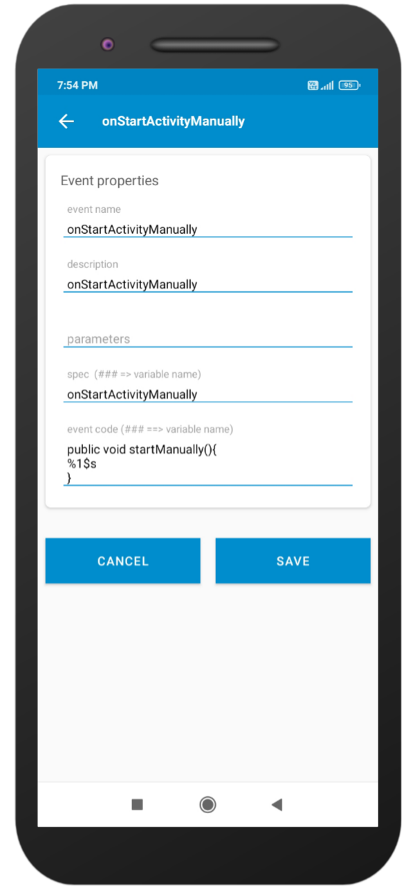

# You need to add the following event to run project without breaking.
Open Sketchware pro.

Go to `developer console`.

Click on `Event manager`.

Click on `Activity events` at the top.

Click on add icon.

Fill the all fields by copy paste as follow or fill the fields as shown in image.

---
event name - `onStartActivityManually`

description - `onStartActivityManually`

parameters - 

spec - `onStartActivityManually`

event code - 
```java
public void startManually(){
%1$s
}
```

---
